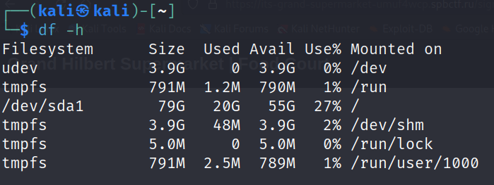
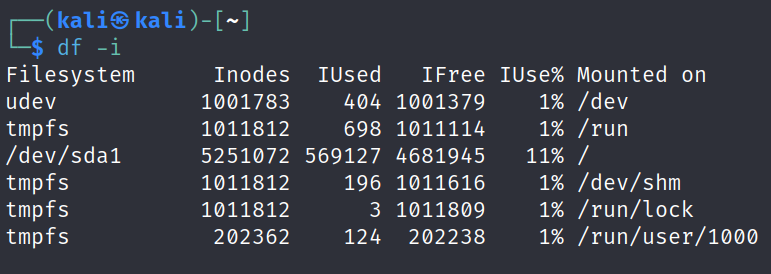

## Disk Space Analysis

### Available Disk Space:

To check the available disk space on the operating system, I used the `df -h` command on my Linux system:

```bash
$ df -h
```

**Sample Output**:



### Inodes Analysis:

To check the number of inodes on the operating system, I used the `df -i` command on my Linux system:

```bash
$ df -i
```

**Sample Output**:


## Resource Consumption Analysis

### Most RAM and CPU Consuming Processes:

To identify the processes consuming the most RAM and CPU on my operating system, I used the following command on my Linux system:

```bash
$ ps -eo pid,%mem,%cpu,cmd --sort=-%mem | head
```

**Sample Output**:


### Observations and Insights:

- The `ps` command is used to provide information about the currently running processes, including their process identification numbers (PIDs). 
- The `ps` command is a built-in command and comes pre-installed with the operating system. 
- The `-e` option is used to display information about all the processes on the system, instead of just the ones that are owned by the current user. 
- The `-o` option is used to specify the output format. 
- The `pid` option is used to display the process identification number. 
- The `%mem` option is used to display the percentage of physical memory used by the process. 
- The `%cpu` option is used to display the percentage of CPU time used by the process. 
- The `cmd` option is used to display the command used to start the process. 
- The `--sort=-%mem` option is used to sort the processes in the output based on the percentage of physical memory used by them, in descending order. 
- The `| head` command is used to display only the first 10 lines of the output.