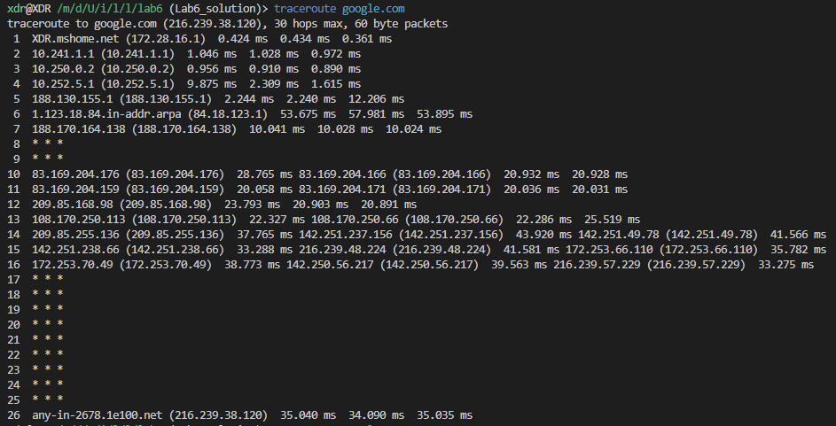
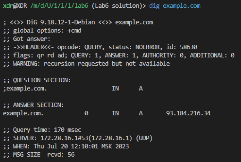

## Traceroute Analysis

### Perform Traceroute to google.com (216.239.38.120)

To analyze the network path and latency to Google's website (216.239.38.120), I used the `traceroute` command on my Linux system:

```bash
$ traceroute google.com
```

### Traceroute Output:


### Observations and Insights:

**From the traceroute output, we can observe the following**:

1. The traceroute took 26 hops to reach the destination (216.239.38.120), and the maximum hop count is set to 30.
2. Each line in the output represents an intermediate router or hop along the network path.
3. The time in milliseconds (ms) represents the round-trip time (RTT) between the source and the respective router/hop.

**Insights**:

1. The initial hops are to the local router and internal network IPs (172.28.16.1, 10.241.1.1, etc.).
2. Subsequent hops traverse various routers operated by ISPs.
3. There are some hops where the response times are not provided (* * *), indicating that the routers might be configured not to respond to traceroute requests.
4. The final hop successfully reaches the destination IP 216.239.38.120, which is a Google server.

## Dig Analysis

### Perform DNS Lookup for "example.com"

To analyze the DNS resolution for the domain "example.com," I used the `dig` command on my Linux system:

```bash
$ dig example.com
```

### Dig Output:


### Observations and Insights:

**From the `dig` output, we can observe the following**:

1. The DNS resolution for the domain "example.com" was successful (status: NOERROR).
2. The IP address associated with "example.com" is 93.184.216.34.

**Insights**:

1. The domain "example.com" is resolved to the IP address 93.184.216.34, which is a valid IP for the example domain.
2. The DNS query was sent to the DNS server with IP address 172.28.16.1 and received a response in 170 milliseconds.