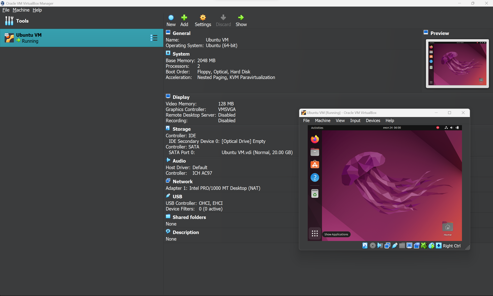

# VM Deployment Report

## Step 1: Install VirtualBox

I installed VirtualBox on my Windows system using Chocolatey package manager. The command used to install VirtualBox through Chocolatey is as follows:

```bash
choco install virtualbox
```

The installed version of VirtualBox is **7.0.10**.

## Step 2: Deploy a Virtual Machine

1. I opened VirtualBox and clicked on the "New" button to create a new virtual machine.

2. In the "Create Virtual Machine" wizard:
   - Name: Ubuntu VM
   - Type: Linux
   - Version: Ubuntu (64-bit)

3. I allocated **2048 MB** of memory (RAM) for the VM.

4. I created a virtual hard disk with the following specifications:
   - File type: VDI (VirtualBox Disk Image)
   - Storage on physical hard disk: Dynamically allocated
   - Size: **20 GB**

5. After creating the VM, I selected it in the VirtualBox Manager and clicked on "Settings" to customize the VM settings.

6. In the "Settings" window:
   - System > Processor: I allocated **2 CPU cores** to the VM.
   - Display > Screen: I increased the Video Memory to **128 MB** for better performance.
   - Network: I chose the **NAT adapter** type for the network configuration.

7. I inserted the **Ubuntu ISO file** in the VM's virtual optical drive. To do this, I clicked on "Storage" in the VM settings, selected the "Controller: IDE" section, and then clicked on the disc icon next to "Empty." I chose the Ubuntu ISO file from my local storage.

8. I started the VM by clicking on the "Start" button in the VirtualBox Manager.

9. I followed the Ubuntu installation process within the VM, including selecting the language, time zone, keyboard layout, and creating a user account.

## Screenshot of the Running VM

